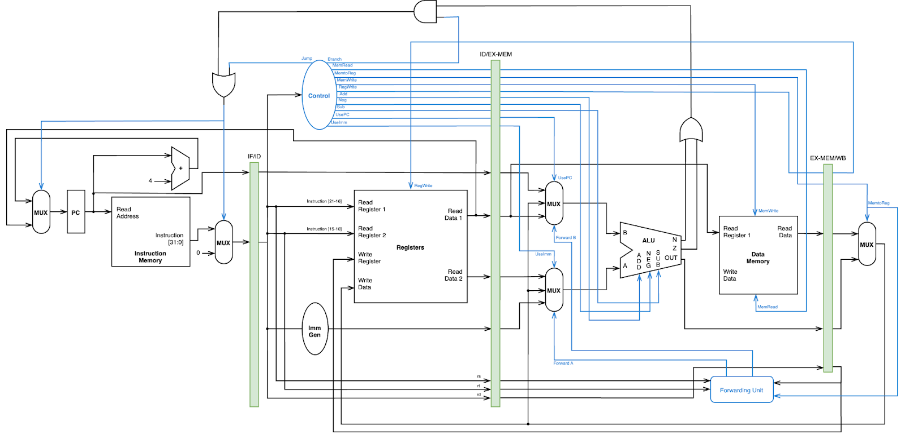

# Project Max Report
Group 19

CSEN 210 Computer Architecture

Professor Yan Cui

Fall 2024

Group members: [John Barckley](mailto:jbarckley@scu.edu) | [Ulises Chavarria](mailto:uchavarria@scu.edu) | [Nishant Misal](mailto:nmisal@scu.edu)

## Table of Contents
- [Project Max Report](#project-max-report)
  - [Table of Contents](#table-of-contents)
  - [Objective](#objective)
  - [SCU ISA](#scu-isa)
  - [C Code](#c-code)
  - [Software Loop](#software-loop)
    - [Assumptions and Restrictions](#assumptions-and-restrictions)
      - [Software Loop Code Explanation](#software-loop-code-explanation)
  - [Hardware Loop - Phase 1](#hardware-loop---phase-1)
  - [Hardware Loop - Phase 2](#hardware-loop---phase-2)
    - [Assumptions and Restrictions](#assumptions-and-restrictions-1)
  - [Datapath and Control Design: 4-Stage Pipeline Overview](#datapath-and-control-design-4-stage-pipeline-overview)
    - [Pipeline Configuration](#pipeline-configuration)
    - [Hazard Management Strategy](#hazard-management-strategy)
      - [1. Data Hazards](#1-data-hazards)
        - [a) First Data Hazard](#a-first-data-hazard)
        - [b) Second Data Hazard](#b-second-data-hazard)
      - [2. Control Hazards](#2-control-hazards)
        - [Branch Hazard Resolution](#branch-hazard-resolution)
        - [Jump Instruction Handling](#jump-instruction-handling)
  - [Datapath](#datapath)
    - [Control Unit Truth Table](#control-unit-truth-table)
    - [Mux A Truth Table](#mux-a-truth-table)
    - [Mux B Truth Table](#mux-b-truth-table)
  - [RISC-V Emulation](#risc-v-emulation)
  - [Performance Evaluation](#performance-evaluation)
    - [Instruction Count](#instruction-count)
    - [Cycle Time](#cycle-time)
    - [Cycles Per Instruction (CPI)](#cycles-per-instruction-cpi)
    - [Execution Time](#execution-time)


## Objective
Without using labels and the table of instructions find the max within a list of numbers.

## SCU ISA
| Instruction        | Symbol         | opcode | rd  | rs  | rt  | Function            |
| ------------------ | -------------- | ------ | --- | --- | --- | ------------------- |
| No operation       | NOP            | 0000   | -   | -   | -   | No operation        |
| Save PC            | SVPC rd, y     | 1111   | rd  | y   | y   | xrd <- PC + y       |
| Load               | LD rd, rs      | 1110   | rd  | rs  | -   | xrd <- M[xrs]       |
| Store              | ST rt, rs      | 0011   | -   | rs  | rt  | M[xrs] <- xrt       |
| Add                | ADD rd, rs, rt | 0100   | rd  | rs  | rt  | xrd <- xrs + xrt    |
| Increment          | INC rd, rs, y  | 0101   | rd  | rs  | y   | xrd <- xrs + y      |
| Negate             | NEG rd, rs     | 0110   | rd  | rs  | y   | xrd <- -xrs         |
| Subtract           | SUB rd, rs, rt | 0111   | rd  | rs  | rt  | xrd <- xrs - xrt    |
| Jump               | J rs           | 1000   | -   | rs  | -   | PC <- xrs           |
| Branch if zero     | BRZ rs         | 1001   | -   | rs  | -   | PC <- xrs, if Z = 1 |
| Jump memory        | JM rs          | 1010   | -   | rs  | -   | PC <- M[xrs]        |
| Branch if negative | BRN rs         | 1011   | -   | rs  | -   | PC <- xrs, if N = 1 |
| Max                | MAX rd, rs, rt | 0001   | rd  | rs  | rt  | See note*           |

*Note: Max{memory[xrs], memory[xrs + 1], …, memory[xrs + xrt -1]}

*Note: `-` doesn't matter 

## C Code
```c
 int findmax(int arr[], int size){
    int max = arr[0]; 
    for(int i = 1; i < size; i++){
        if (arr[i] - max >= 0){
            max = arr[i]; 
        }
    }
    return max;
}
```

## Software Loop
This program finds the max integer in an array “arr” of length “size”

### Assumptions and Restrictions
1. x10 = &arr[0]
2. x11 = size
3. At any given instruction, the PC holds the address of the next instruction
4. No labels allowed
5. `#` are comments

```asm
SVPC x1, 0x0
INC x12, x1, 0x 18  # x12 = &Loop
INC x13, x1, 0x30   # x13 = &LoopIncrement
INC x14, x1, 0x3c   # x14 = &LoopEnd
INC x5, x0, 0x1     # x5 => i = 1
LD x6, x10          # x6 => max = arr[0]
INC x7, x10, 0x4    # x7 = &arr[i] => aka &arr[1]

#Loop
SUB x15, x5, x11    # x15 => i - size
BRZ x14             # if (i == size) => end of array, so exit loop
LD x15, x7          # x15 = arr[i]
SUB x16, x15, x6    # x16 = arr[i] - max
BRN x13             # when arr[i] < max, go to next iteration of loop
ADD x6, x0, x15     # x6 => max=arr[i]

#LoopIncrement
INC x5, x5, 0x1     # x5 => i++
INC x7, x7, 0x4     # x7 => &arr[i++]
J x12               # start next iteration of Loop

#LoopEnd
ADD x10, x6, x0     # store max in return register
```

#### Software Loop Code Explanation

Initialization and Address Saving:
`SVPC x1, 0x0`
- Saves the Program Counter (PC) into register x1
- Enables capturing memory addresses of code sections

Label Address Preparation:
`INC x12, x1, 0x18`, `INC x13, x1, 0x30`, `INC x14, x1, 0x3c`
- Stores precise addresses for different code sections and loop control

Loop Variable Setup:
`INC x5, x0, 0x1`, `LD x6, x10`, `INC x7, x10, 0x4`
- Initializes loop counter (i = 1)
- Loads initial array element as the first max value
- Sets up pointer to next array element

Loop Condition Check:
`SUB x15, x1, x5`, `BRZ x14`
- Calculates remaining array elements (size - current index)
- Branches to loop end when all elements are processed

Element Comparison:
`LD x15, x7`, `SUB x16, x15, x6`, `BRN x13`
- Loads current array element
- Compares current element with existing max value
- Skips max replacement if current element is smaller

Max Value Update:
`ADD x6, x0, x15`
- Updates max value when current element is greater or equal

Loop Increment:
`INC x5, x5, 0x1`, `INC x7, x7, 0x4`, `J x12`
- Increments loop counter
- Advances array element pointer
- Jumps back to loop start

Result Preparation:
`ADD x10, x6, x0`
- Moves final max value to return register (x10)


## Hardware Loop - Phase 1
This program finds the max integer in an array “arr” of length “size”

Assumptions
1. x10 = &arr[0]
2. x11 = size

```asm
MAX x10, x10, x11
```

## Hardware Loop - Phase 2
Using the `MAX` instruction find the maximum number out of `n` numbers (like finding the max in an array).

### Assumptions and Restrictions
1. `x1` - Maximum value
2. `x10` - Base address of array (&arr[0])
3. `x11` - Size of input array

```asm
LD x11, x10        # load the size of array from base address to x11
INC x10, x10, 0x4  # move current position to the first element of the array
MAX x1, x10, x11   # find maximum element of the array using MAX instruction
```

## Datapath and Control Design: 4-Stage Pipeline Overview

### Pipeline Configuration

- Reduced traditional 5-stage pipeline to 4 stages
- Combined Execute (EX) and Memory (MEM) stages
- **Rationale:** SCU ISA software limitations
  * Data Memory Unit used only for LD instruction
  * LD instruction directly moves data from Memory to Register without ALU dependency

### Hazard Management Strategy

#### 1. Data Hazards

- Minimal instruction interactions in software code
- Handled primarily through Forwarding Unit
- Two primary data hazard scenarios identified:

##### a) First Data Hazard

- **Instructions:** `SVPC x1, 0x0` → `INC x12, x1, 0x18`
- **Problem:** `SVPC` writes to x1, which `INC` subsequently uses
- **Solution:** Forward new x1 value from Write-Back (WB) stage to Execute-Memory (EX-MEM) stage

##### b) Second Data Hazard

- **Instructions:** `LD x15, x7` → `SUB x16, x15, x6`
- **Problem:** `LD` writes to x15, which `SUB` subsequently uses
- **Solution:** Forward new x15 value from Write-Back (WB) stage to Execute-Memory (EX-MEM) stage

#### 2. Control Hazards

- Handled through pipeline flushing mechanism
- Triggered by branch and jump instructions
- Uses logic gate sequence to insert 1-cycle bubble

##### Branch Hazard Resolution

- **Detection:** Occurs when branch instruction is in Instruction Decode (ID) stage
- **Previous Instruction:** In Execute-Memory (EX-MEM) stage (e.g., `SUB`)
- **Resolution Process:**
  * OR the N and Z flags from ALU
  * AND result with branch flag from Control Unit
  * If branch condition met:
    - First multiplexer passes new branch address
    - Second multiplexer inserts zero into IF/ID pipeline register

##### Jump Instruction Handling

- Automatic 1-cycle flush when jump control unit flag is active
- Implemented via final OR gate in control logic

## Datapath


### Control Unit Truth Table
| SVPC | OpCode | Jump | Branch | MemRead | MemToReg | MemWrite | RegWrite | Add | Neg | Sub | UsePC | UseImm |
| ---- | ------ | ---- | ------ | ------- | -------- | -------- | -------- | --- | --- | --- | ----- | ------ |
| SVPC | 1111   | 0    | 0      | 0       | 0        | 0        | 1        | 1   | 0   | 0   | 1     | 1      |
| LD   | 1110   | 0    | 0      | 1       | 1        | 0        | 1        | x   | x   | x   | x     | x      |
| ADD  | 0100   | 0    | 0      | 0       | 0        | 0        | 1        | 1   | 0   | 0   | 0     | 0      |
| INC  | 0101   | 0    | 0      | 0       | 0        | 0        | 1        | 1   | 0   | 0   | 0     | 1      |
| SUB  | 0111   | 0    | 0      | 0       | 0        | 0        | 1        | 0   | 0   | 1   | 0     | 0      |
| J    | 1000   | 1    | 0      | 0       | x        | 0        | 0        | x   | x   | x   | x     | x      |
| BRZ  | 1001   | 0    | 1      | 0       | x        | 0        | 0        | x   | x   | x   | x     | x      |
| BRN  | 1011   | 0    | 1      | 0       | x        | 0        | 0        | x   | x   | x   | x     | x      |

### Mux A Truth Table
| UsePC | ForwardB | Output          |
| ----- | -------- | --------------- |
| 0     | 0        | rs              |
| 0     | 1        | Write back data |
| 1     | 0        | PC              |
| 1     | 1        | x (don't care)  |

### Mux B Truth Table
| UsePC | ForwardB | Output          |
| ----- | -------- | --------------- |
| 0     | 0        | rt              |
| 0     | 1        | Write back data |
| 1     | 0        | Imm             |
| 1     | 1        | x (don't care)  |

## RISC-V Emulation
| RISC-V            | SCU ISA                                                                                           |
| ----------------- | ------------------------------------------------------------------------------------------------- |
| ADD rd, rs1, rs2  | ADD rd, rs1, rs2                                                                                  |
| SUB rd, rs1, rs2  | SUB rd, rs1, rs2                                                                                  |
| ADDI rd, rs1, imm | INC rd, rs, imm                                                                                   |
| LW rd, imm(rs1)   | INC rs1, rs1, imm                                                                                 |
| LD rd, rs1        | INC rs1, rs1, imm                                                                                 |
| SW rs2, imm(rs1)  | ST rs2, rs1                                                                                       |
| AND rd, rs1, rs2  | SUB rd, rd, rd<br>SVPC x12, 16<br>ADD rs1, rs1, rs2<br>BRZ x12<br>INC rd, rs1, -1                 |
| NOP               | NOP                                                                                               |
| OR rd, rs1, rs2   | SUB rd, rd, rd<br>SVPC x12, 16<br>ADD rs1, rs1, rs2<br>BRZ x12<br>INC rd, rd, 1                   |
| NOP               | NOP                                                                                               |
| NOR rd, rs1, rs2  | SUB rd, rd, rd<br>INC rd, rd, 1<br>SVPC x12, 16<br>ADD rs1, rs1, rs2<br>BRZ x12<br>INC rd, rd, -1 |
| NOP               | NOP                                                                                               |
| ANDI rd, rs1, imm | SUB rd, rd, rd<br>SVPC x12, 16<br>ADD rs1, rs1, imm<br>BRZ x12<br>INC rd, rd, -1                  |
| NOP               | NOP                                                                                               |
| BEQ rs1, rs2, imm | SVPC x6, imm<br>SUB x7, rs1, rs2<br>BRZ x6                                                        |
| JAL rd, imm       | SVPC rd, 4<br>SVPC x6, imm<br>J x6                                                                |
| JALR rd, rs1, imm | INC rt, rd, imm<br>J x6                                                                           |

## Performance Evaluation

### Instruction Count
- **Calculation:** 9 instructions in the loop + 8 outside the loop
- **Formula:** 9n + 8, where n is the number of array elements

### Cycle Time
- **Datapath:** 4-stage pipeline
- **Longest Delay:** 3 ns
- **Clock Cycle Time:** 3 ns

### Cycles Per Instruction (CPI)
- **Formula:** (9n + 12) / (9n + 8)
- **Example (3-element array):** (9 * 3 + 12) / (9 * 3 + 8) = 1.114

### Execution Time
- **Formula:** (Instruction Count) * (CPI) * (Clock Cycle Time)
- **Detailed Calculation:** (9n + 8) * [(9n + 12) / (9n + 8)] * 3 ns
- **Example (3-element array):** 
  * (9 * 3 + 8) * 1.114 * 3 ns 
  * = 117 ns

**Notes:**
- Calculations assume a general array size of n elements
- Performance metrics demonstrate slight overhead due to loop control instructions